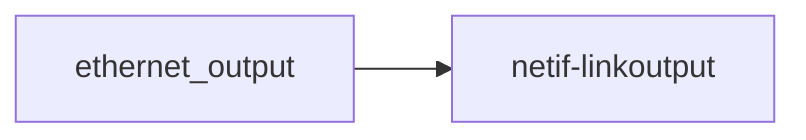
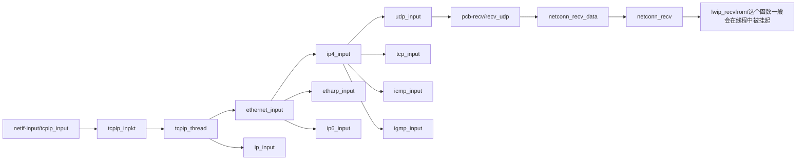

### 数据发送
发送流程：

```mermaid
graph LR
ethernet_output -->  netif-linkoutput
```

### 数据接收
接收流程：

```mermaid
graph LR
netif-input/tcpip_input --> tcpip_inpkt --> tcpip_thread --> ethernet_input
tcpip_thread --> ip_input

ethernet_input --> ip4_input
ethernet_input --> etharp_input
ethernet_input --> ip6_input

ip4_input --> udp_input
ip4_input --> tcp_input
ip4_input --> icmp_input
ip4_input --> igmp_input

udp_input --> pcb-recv/recv_udp --> netconn_recv_data --> netconn_recv --> lwip_recvfrom/这个函数一般会在线程中被挂起
```

### 宏定义
> NETIF_FLAG_UP
> 网络接口是否处于启动状态。
> 用于控制网络接口是否使能和处理流量。